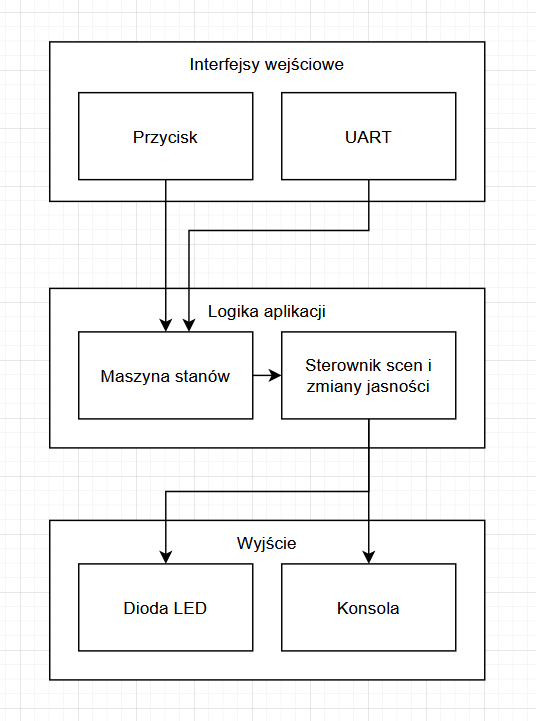

# Dokumentacja Projektu: Sterownik Oświetlenia

## Architektura Systemu (Diagram Blokowy)
System został zaprojektowany w architekturze warstwowej, co zapewnia separację logiki od sprzętu.

- Interfejsy wejściowe - Sterownik przycisku, oraz protokół UART.
- Warstwa Logiki Aplikacji - Obsługa maszyny stanów oraz sterowanie jasnością diody i sterowanie scenami.
- Wyjście - Sterownik diody, oraz wypisywanie danych do konsoli

## Maszyna Stanów (FSM Graf)
System zarządza stanem pracy urządzenia w sposób deterministyczny.

**Stany:**
-  INIT: Autotest urządzenia (mignięcie LED) zaraz po starcie.
-  IDLE: Stan oczekiwania (LED wyłączony).
-  RUN: Stan aktywnego świecenia lub zmiany jasności.
-  FAULT: Tryb awaryjny (aktywacja po zablokowaniu przycisku na 3s).

**Przejścia:**
- IDLE -> RUN: Przycisk lub komenda ON / SCENE.
- RUN -> IDLE: Przycisk lub komenda OFF.
- Dowolny -> FAULT: Zablokowanie przycisku (3s).
- FAULT -> IDLE: Ponowne kliknięcie po ustąpieniu blokady.

## Protokół Komunikacyjny UART
Komunikacja odbywa się przez interfejs szeregowy. Protokół obsługuje buforowanie linii (oczekiwanie na znak \n).

**Lista komend:**
- ON - Ustawia jasność na 100% - `UART: Aktywowano rozjasnianie (100%)` 
- OFF - Ustawia jasność na 0% - `UART: Aktywowano gaszenie (0%)` 
- SET:X - Ustawia jasność na wartość X (0-100) - `UART: Ustawiono cel na 50%` 
- SCENE:N - Aktywuje scenę (SUNSET, NIGHT, DAY) - `LOGIC: Uruchomiono scene DAY (100%)` 
- STATS - Wyświetla pełny raport telemetrii 

## Logika Sterowania
System wykorzystuje Fixed-priority Scheduler(FreeRTOS) z tickiem 100ms.

**Algorytm Slew-rate:**
* W każdym cyklu (100ms) jasność jest zmieniana o stały krok BRIGHTNESS_STEP = 5.0.
* Zapewnia to płynne przejście (fade) trwające 2 sekundy dla pełnego zakresu 0-100%.
* Wprowadzono metrykę latency, która mierzy rzeczywisty czas narastania sygnału od startu do osiągnięcia celu.